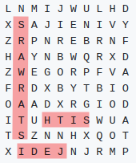
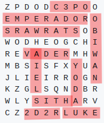

# Word Search Puzzle

Word search puzzles generator. Utility and library.

## Installation

Install the gem by executing:

    $ gem install word-search-puzzle

## Usage

Execute `word-search-puzzle` from the command line.

**Example**: create puzzle with default options.

```
$ word-search-puzzle create --words=JEDI,SITH,STARWARS
```


> Each execution builds a different puzzle.

**Example**: Create a puzzle showing the final solution. 
```
$ word-search-puzzle create --words=VADER,OBIWAN,LUKE --padding='.' --size=6x6
 . R . . . .
 . . E . . .
 . . . D . .
 O B I W A N
 . . . . . V
 E K U L . .
```

**Example**: Create puzzle reading words from text file.
```
$ word-search-puzzle create --words=examples/starwars.txt                   
```


> **WARNING:**
> Depending on the number and size of the words, the size of the grid, and the numbers of gaps, sometimes it will not be possible to find a solution.

## Documentation

* [Command line options and examples](docs/options.md)
* [Examples using the Ruby library](examples/)
* [Development](docs/development.md)

## Contributing

Bug reports and pull requests are welcome on GitHub at https://github.com/dvarrui/word-search-puzzle.

