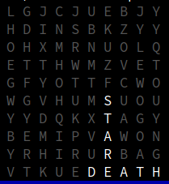

[<< back](../README.md)

# Command line options

## Help

* Show help: `word-search-puzzle help`
* Show **create** action help: `word-search-puzzle help create`

# Building options

> Used to create different puzzles.

* `--words`, Comma separated list of word or file name with de words.
* `--size`, Grid size. Default value 10.

## Words options

**Example**: Create puzzle using these words: JEDO, SITH, STARWARS.
```
$ word-search-puzzle create --words=JEDI,SITH,STARWARS
 D S O I D P O V W K
 N J E D I D H P Q T
 Q S T L M J Z N R M
 L T O Y U B S B L P
 N A K H W Q I K C K
 G R Y D E I T R I N
 N W E F H U H U F H
 R A B S J U G M K U
 U R V M A F H W D H
 Q S O S L I V R O C
```

**Example**: Create puzzle reading words from TXT file.
```
$ word-search-puzzle create --words=examples/starwars.txt 
 A W L U K E D W Y G
 O P 3 C R C D G W Z
 S R A W R A T S E S
 T Y O D A D N U Q L
 V R O D A R E P M E
 A R Y O B I W A N C
 D H 2 W D F L I G K
 E Y S D X S N E D N
 R V H U 2 E B V I W
 R J F S I T H G S A
```

## Size option

**Example**: Create default size puzzle (10 rows and 10 cols).
```
$ word-search-puzzle create --words=examples/starwars.txt        
 X U B R E D A V O B
 R N S A D O Y B E T
 2 A R R F M I Z M Z
 D X A I L W Q J P D
 2 H W F A U D E E N
 C T R N L M K S R X
 H J A B H A S E A U
 G V T W H I I O D N
 E R S T S E T S O X
 Q C 3 P O L H W R M
```

**Example**: Create 8x20 puzzle (8 rows and 20 cols).
```
$ word-search-puzzle create --words=examples/starwars.txt --size=8x20
 C E K U L K W S S I Y I G O B I W A N X
 L E F A T F S L W O C Y R 2 D 2 I Z P P
 E Y V S J R N U D O Y L R H X Q O Q N O
 Y H W T I C H A T V V J F G K R E O M Z
 P N V Y P S P G J J R I J O P 3 C I S O
 K Z K X T R O D A R E P M E T L E I A N
 S R A W R A T S X Z E L O B A W T P Y O
 D S L L G M N C A V A D E R O H C L L G
```

*+Example**: Create 9x9 puzzle (rows and 9 cols).
```
$ word-search-puzzle create --words=examples/starwars.txt --size=9
 X R I Y O Y S V B
 T O O Q B L R H Z
 J D C V I U A T T
 A A K A W K W I O
 O R L D A E R S P
 N E E E N 2 A I 3
 M P I R D J T K C
 L M A 2 K Z S V T
 R E R G I P N Z W
```
# Rendering options

> Used to display the puzzle in different ways.

* `--color`, Indicates whether to display the output with color. Default value false.
* `--padding=LIST`, comma.separated list of characters to fill in the gaps in the puzzle. Default value A-Z.
* `--gaps=FILEPATH`, Filename with list of gaps coordinates. List of `row,col` integers.

## Color option

The `color` option, highlights the list of words within the puzzle, so we can easily identify their location.

```
$ word-search-puzzle create --words=DEATH,STAR --color
```


## Padding option

In the puzzle creation process, we first place the word list inside the grid and then fill in the blanks with random letters until the grid is completely filled.

During this step, the letters A through Z will be used by default as random values.

However, in some cases, the words in our puzzle may use other characters set (for example, Japanese characters), so we use `padding` option set custom random character fill list

**Example**: Using `padding` option to custom random padding values.

```
$ word-search-puzzle create --words=DEATH,STAR --padding='+,*,x' 
 * x * + x x * * x x
 * x x + x * * * * x
 + x * * + x * * + +
 + + x x + x + * x +
 * * * + * + + + + x
 + * x + * + H x * x
 + * + + x T + + x *
 + x + x A * + + + +
 x x x E * + R A T S
 x x D * x + * * x x
```

## Gaps option

The grid is a group of cell into square or a rectangle shape. However, this program offers us to customize the grid shape.

To do this, first we start with a square grid and gradually remove the cells defined by `gaps` option to customize the shape.

**Example**: Using `gaps` to customize grid shape.

```
$ word-search-puzzle create --words=DEATH,STAR --gaps=examples/ball-shape.txt
                    
       N L P T      
     O R P S P O    
   V E A S T D P Q  
   Y O B B A H C X  
   O P B M R T W K  
   V O I P K A F T  
     H H J N E X    
       U J D D  

```

We can define gaps in two ways:
1. Using a [TXT file](../examples/ball-shape.txt), where the dot (`.`) character represents a gap and `@` represents an available cell.
2. Using a [CSV file](../examples/ball-gaps.csv), where each line contains the coordinates (row, column) of a gap.
